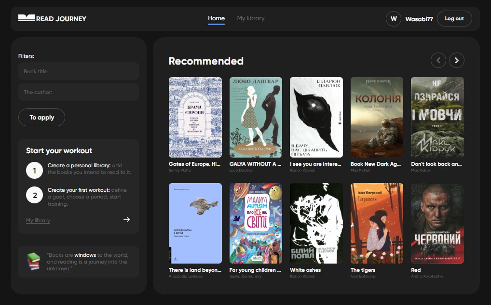

## ℝ𝕖𝕒𝕕 𝕁𝕠𝕦𝕣𝕟𝕖𝕪

  

This project was created using [Create React App](https://github.com/facebook/create-react-app).  
The app allows you to find and/or create your own books to read.   
It is also possible to filter by title or author and add books of interest to own library. 
In reading mode it is possible to track progress by different data (percentage, number of pages read and total, etc.).  

## 𝔽𝕖𝕒𝕥𝕦𝕣𝕖𝕤 ᎓    

※ Registration at the start.  
※ View a list of recommended books  
※ Filter books based on various criteria  
※ Moving existing and creation own books to your library   
※ Pagination for browsing through the books list  
※ Reading progress (dates, percentages and number of pages read), deleting individual blocks of statistics.   

## 𝕋𝕖𝕔𝕙𝕟𝕠𝕝𝕠𝕘𝕚𝕖𝕤 ᎓  

</a>&nbsp;
  &nbsp;
  &nbsp;
  &nbsp;
  &nbsp;
  &nbsp;
  &nbsp;
  &nbsp;
  &nbsp;  
  
※ [React.js](https://react.dev): for building user interfaces.   
※ [React Router DOM](https://www.npmjs.com/package/react-router-dom): Declarative routing for React web applications.  
※ [Redux Toolkit](https://redux-toolkit.js.org): State management for React applications.  
※ [Styled Components](https://styled-components.com): Styling library for React components.  
※ [Formik](https://formik.org/) and [Yup](https://formik.org/docs/tutorial#schema-validation-with-yup): for data collection and validation.  
※ [Axios](https://axios-http.com): HTTP client for database operation.  
※ [Swagger](https://readjourney.b.goit.study/api-docs/): for authorization and database.  
※ [Progress Bar](https://www.npmjs.com/package/rc-progress): Progress Bar.  

## 𝕀𝕟𝕤𝕥𝕒𝕝𝕝𝕒𝕥𝕚𝕠𝕟 ᎓  

To get started with this project, follow the installation instructions below.

1. Clone the repository:
   ```bash
   git clone https://morifer79.github.io/react-project_read-journey.git
   cd react-project_read-journey-app
   ```
2. Install the dependencies:
   ```bash
   npm install
   ```
3. Start the development server:
   ```bash
   npm start
   ```
4. Open to view it in the browser:  
<a href="https://morifer79.github.io/react-project_read-journey/"></a>  

5. Open to view file Layout:  
<a href="https://www.figma.com/file/z3m0rdBcEfLTJUBDkAKhWQ/BOOKS-READING?type=design&node-id=18743%3A4973&mode=design&t=Hi1KTaUJMogWXZzz-1"></a>  

## 𝔼𝕞𝕒𝕚𝕝 𝕞𝕖 ᎓
Questions, suggestions, help:  
<a href="mailto:cyber-morifer@proton.me"></a>
   
